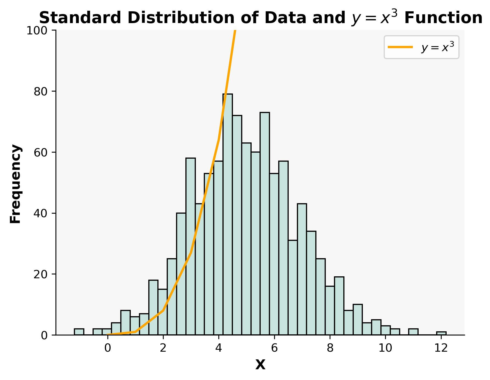

# pands-weekly-tasks

This is the repository of Aoife Flavin. The purpose of this repoitory is to complete the weekly problem sets given in the module Programming and Scripting, in Semester 1 of the Higher Diploma in Data Analytics at ATU.

In each section I will detail my approach to solving the assigned tasks and cite the sources I used while problem-solving.

I have previously completed very basic python training so some tasks did not require extensive research.


## Table of Contents
* Hello World
* Bank
* Accounts
* Collatz
* Weekday
* Square Root
* Count E's
* Plot Task
(make these links once this is filled out more)

---
## ***Hello World***
### Description:
The veru first program simply prints out the words "Hello World"

## ***Bank***
    Write a program called bank.py 
    The program should:
    a. Prompt the user and read in two money amounts (in cent)
    b. Add the two amounts
    c. Print out the answer in a human readable format with a euro sign and decimal point between the euro and cent of the amount 

### Description:
The bank.py program is a simple utility that allows users to add two monetary amounts and display the result in a human-readable format. When called it asks the user to input an amount in cent, then asks for another amount in cent. The program adds these cent amounts together, then uses the // function to fnd the Euro amount and the % function to find the remaining sent amount. The result is then formatted and printed

<details>
           <summary>User point of view</summary>
           <p>

User call of the program is :

```
λ python bank.py
```
User input :
```
Enter amount one (in cent): 75
Enter amount two (in cent): 99
```
and the output is :

```
The sum of these amounts is: €1.74
```
</p>
</details>

#### Sources:
n/a

## ***Accounts***
    Write a python program called accounts.py that reads in a 10 character account number and outputs the account number with only the last 4 digits showing (and the first 6 digits replaced with Xs).
    Modify the program to deal with account numbers of any length.

### Description:
This program begins by asking the user to input a 10 digit number, as a string. The program then takes this input and turns it from a string to a list. It then slices the first 6 items in the list using indexing and replaces the characters with X's. Finally the join() method is used to turn the list back into a string, with no spaces between the letters.

For this program to read in an account number of any length, and stll replace all numbers except the last four, the process is mostly the same. The difference lies in the indexing used when slicing the list. For a list of any size the program is told to replace all numbers with X's ***except*** the last four.

<details>
           <summary>User point of view</summary>
           <p>

User call of the program is :

```
λ python accounts.py
```
User input :
```
Please enter an 10 digit account number: 1234567890
```
and the output is :

```
XXXXXX7890
```
User input :
```
Please enter an account number of any length:997843984584593893
```
and the output is :

```
XXXXXXXXXXXXXX3893
```

</p>
</details>

#### Sources:
https://www.geeksforgeeks.org/python-program-convert-string-list/
https://www.geeksforgeeks.org/how-to-replace-values-in-a-list-in-python/

## ***Collatz*** 
    Write a program, called collatz.py, that asks the user to input any positive integer and outputs the successive values of the following calculation.
    At each step calculate the next value by taking the current value and, if it is even, divide it by two, but if it is odd, multiply it by three and add one.
    Have the program end if the current value is one.

### Description:
This program prompts the user to input a positive integer. If the user enters a negative integer, the program requests a positive value until a valid input is provided. Once a positive integer is entered, the program enters a while loop. Within the loop, the program continuously outputs the current number with a space next to it while performing calculations.

Using an if statement, the program checks whether the current number, when divided by two, results in no remainder. If so, the number is divided by two. If there is a remainder, indicating an odd number, the number is multiplied by three and one is added. This process continues until the number becomes one, at which point the loop exits.

<details>
           <summary>User point of view</summary>
           <p>

User call of the program is :

```
λ python collatz.py
```
User input :
```
Please enter a positive integer: 10
```
and the output is :

```
10 5 16 8 4 2 1
```
</p>
</details>

#### Sources:
https://www.geeksforgeeks.org/loops-in-python/

## ***Weekday*** 
    Write a program that outputs whether or not today is a weekday.

### Description:
To complete this task the datetime module must be imported. A function called 'is_weekday()' is then defined that assigns the variable today to the current day of the week. The function then checks if today is equal to any day between monday and friday using an if statement and indexing.

When the function is called, an if statement is used to say 'Yes' if it is a weekday, or 'No' if it is the weekend.

<details>
           <summary>User point of view</summary>
           <p>

User call of the program is :

```
λ python weekday.py
```
If ran on a weekday the output is:
```
Yes, unfortunately today is a weekday.
```
If ran on the weekend the output is:

```
It is the weekend, yay!
```
</p>
</details>

#### Sources:
https://www.geeksforgeeks.org/get-current-date-and-time-using-python/
https://www.w3schools.com/python/python_functions.asp
https://chat.openai.com/


## ***Square Root***
    Write a program that takes a positive floating-point number as input and outputs an approximation of its square root.
    Create your own sqrt function, do not use the built in functions x ** .5 or math.sqrt(x).

### Description:
The function sqrt() is first defined. Within this function if an integer <0 is input the number is divided by two to give an initial estimate. The desired accuracy of the estimate is set to 1e-10 in the variable 'difference'.

Next, a while loop is started that will continue until the conditions are met to break out of the loop. Inside the loop a new estimate of the square root is calculated using the Newton-Raphson method. Then the difference between that estimate and the previous estimate is compared against the difference variable. If the difference is less than the difference variable, the loop exits. Once the loop exits the final estimate is returned.

In the testing section the user is prompted to input a positive number. If the number inputed is less than zero, an error message will appear. If 0 is inputed, 0 will be returned as the square root of zero is zero. If a positive integer is input the sqrt() function will be called, the square root calculated and the result printed out.


<details>
           <summary>User point of view</summary>
           <p>

User call of the program is :

```
λ python squareroot.py
```
User input :
```
Please enter a positive number: 568
```
and the output is :

```
The square root of 568.0 is approx 23.832750575625973
```
</p>
</details>

#### Sources:
https://www.youtube.com/watch?v=-5e2cULI3H8
https://stackoverflow.com/questions/40390129/what-does-e-in-1e-5-in-python-language-mean-and-what-is-the-name-of-this-not
https://pythonnumericalmethods.studentorg.berkeley.edu/notebooks/chapter19.04-Newton-Raphson-Method.html
https://chat.openai.com/
https://www.datacamp.com/tutorial/exception-handling-python

## ***Count E's***
    Write a program that reads in a text file and outputs the number of e's it contains.
    The program should take the filename from an argument on the command line.

### Description:
This program reads a text file (in this case I had it read Moby Dick), and counts the number of times the letter 'e' occurs.
This was done by first creating a function that opens a file, reads it and records the number of times a particular letter occurs.
If the file does not exist a File not found error occurs.
The main part of the program takes the file, that has been passed as an argument and assigns it to a variable. 
The function that was created earlier is called with the variable assigned to the letter e, which has the program count all the e's in the text file.
Finally, the result is printed out.


<details>
           <summary>User point of view</summary>
           <p>

User call of the program is :

```
λ python count_es.py mobydick.txt
```

and the output is :

```
The letter e occurs 58820 times in mobydick.txt
```
</p>
</details>

#### Sources:
https://www.sanfoundry.com/python-program-read-contents-file/
https://moez-62905.medium.com/the-ultimate-guide-to-command-line-arguments-in-python-scripts-61c49c90e0b3
https://www.w3schools.com/python/python_try_except.asp
https://gist.github.com/StevenClontz/4445774
https://docs.python.org/3/library/exceptions.html

## ***Plot Task***
    Write a program called plottask.py that displays:
    a histogram of a normal distribution of a 1000 values with a mean of 5 and standard deviation of 2, 
    and a plot of the function  h(x)=x3 in the range 0 to 10, on the one set of axes.

### Description:
To create this graph, I first had to import the numpy and matplotlib modules. To plot part 1 of the question numpy was used to create an array of numbers using the numpy.random.normal module, passing through the mean of 5, standard deviation of 2 and size of 1000 as arguments. Then, the plt.hist function of matplotlib was used to create a histogram, with the colour and intervals changed to improve clarity.

To plot the the function $y = x^3$ from part 2 of the question the X points were set to the array 0-10, and the Y points to $Xpoints^3$. The plt.plot function of matplotlib was then used to plot this function.

Having plotted both functions some changes were made to the design of the graph, first adjusting the Y limit to have a clearer view of the histogram. And adding a title, adjusting colours and fonts, adding a legend and removing the top and right spines for clarity and design purposes.

<details>
           <summary>User point of view</summary>
           <p>

User call of the program is :

```
λ python plot_task.py
```
and the output is :



</p>
</details>

#### Sources:
- https://www.geeksforgeeks.org/plot-multiple-plots-in-matplotlib/
- https://www.overleaf.com/learn/latex/Learn_LaTeX_in_30_minutes
- https://python-charts.com/matplotlib/background-color/?utm_content=cmp-true
- https://www.scaler.com/topics/matplotlib/matplotlib-set-axis-range/
